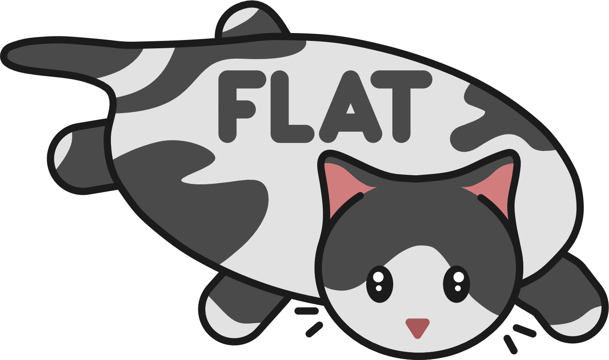

<p align="center">
    
</p> 

# FLAT - PyMOL Script Collection

_FLAT_ is personal collection of scripts and utilities for PyMOL molecular visualizer. The inspiration behind the library is to learn how to work with PyMOL and create a collection of useful functions for easy and convenient use. It is heavily inspired and borrows (_shamelessly steals_) code from [Pymol ScrIpt COllection (PSICO)](https://github.com/speleo3/pymol-psico).

## Installation

In you python environment move into flat directory and run: 

```bash
pip install .
```

To activate all _FLAT_ commands in PyMOL, add this to your `~/.pymolrc.py` file or add it in PyMOL under `File` → `Edit pymolrc`:

```python
import flat.fullinit
```

## License

This program is licensed under the GNU General Public License v3.0

Copyright (C)  2023-2025 [Jure Cerar](https://github.com/JureCerar)

This program is free software: you can redistribute it and/or modify it under the terms of the GNU General Public License as published by the Free Software Foundation, either version 3 of the License, or (at your option) any later version.

This program is distributed in the hope that it will be useful, but WITHOUT ANY WARRANTY; without even the implied warranty of MERCHANTABILITY or FITNESS FOR A PARTICULAR PURPOSE. See the GNU General Public License for more details.

You should have received a copy of the GNU General Public License along with this program. If not, see http://www.gnu.org/licenses/.