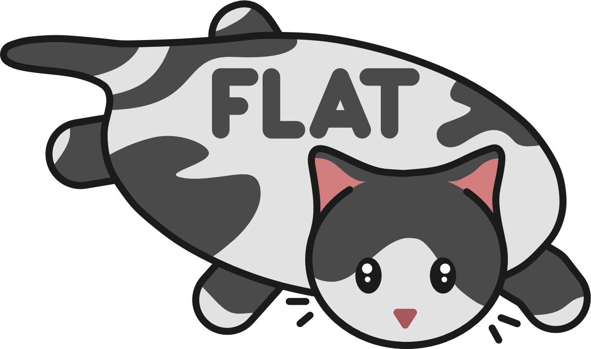

.. Flat documentation master file, created by
   sphinx-quickstart on Sat Apr 11 22:11:44 2026.
   You can adapt this file completely to your liking, but it should at least
   contain the root `toctree` directive.

FlatCAT documentation
=====================

:Version: |release|
:Date: |today|

**FlatCAT** is personal collection of scripts and utilities that extend functionality of PyMOL molecular visualization tool. The inspiration behind the library is to learn how to work with PyMOL and create a collection of useful functions for easy and convenient use. It is heavily inspired and borrows (i.e. *shamelessly steals*) ideas from `Pymol ScrIpt COllection (PSICO)`_.

Source code is available in the public GitHub repository: https://github.com/JureCerar/flat

Installation
------------

The package can be installed by cloning the repository_ and running:

.. code-block:: shell

   pip install .

Usage
-----

Once installed, you can import and initialize package in PyMOL by typing:

.. code-block:: python

   import flat.fullinit

.. note::

   To import **FlatCAT** package in PyMOL at startup, add this to your `~/.pymolrc.py` file or add it in PyMOL under `File` → `Edit pymolrc`.

You can then use built-in help in PyMOL to get command documentation:

.. code-block:: text

   PyMOL> help flat

Getting help
------------

Please report bugs and feature requests for **FlatCAT** through the `Issue Tracker`_.

Contributing
------------

All contributions are welcome. To contribute code, submit a pull request against the master branch in the repository_.

License
-------

This program is licensed under the `GNU General Public License v3.0`_.

.. toctree::
   :caption: Documentation
   :maxdepth: 1
   :hidden:
   :glob:
   
   modules/*

.. Links

.. _`Pymol ScrIpt COllection (PSICO)`:
   https://pymol-psico.readthedocs.io/en/latest/

.. _repository:
   https://github.com/JureCerar/flat

.. _`Issue Tracker`:
   https://github.com/JureCerar/flat/issues

.. _`GNU General Public License v3.0`:
   https://www.gnu.org/licenses/gpl-3.0.html